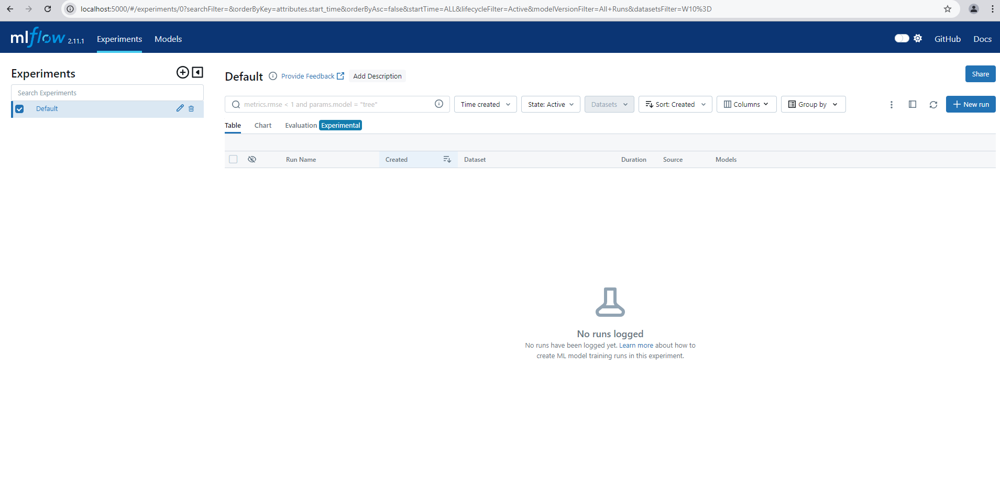
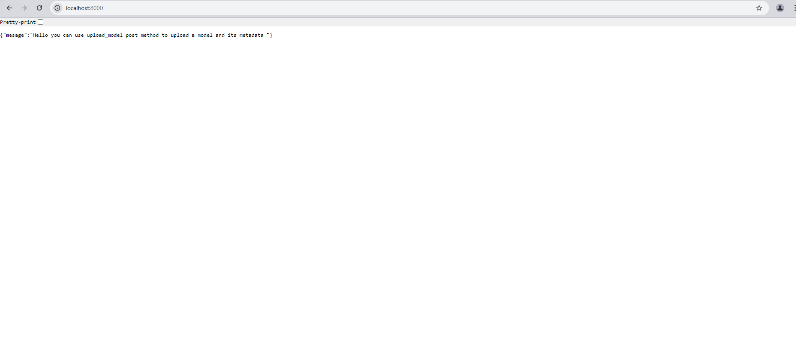
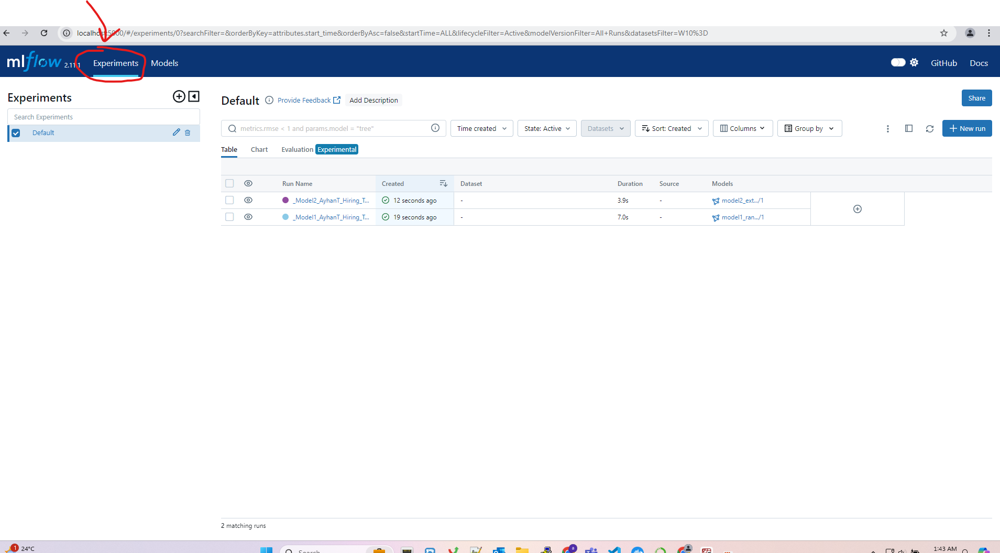
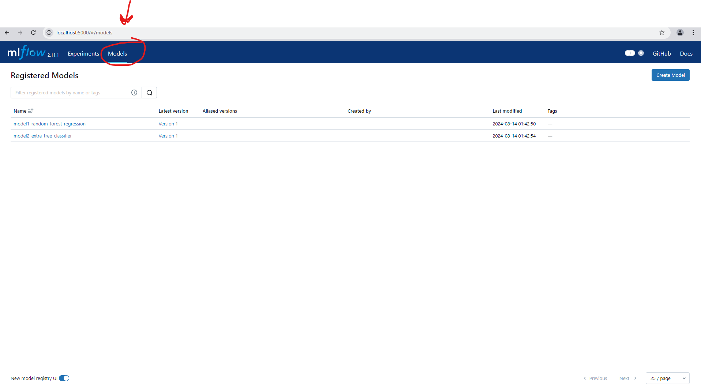
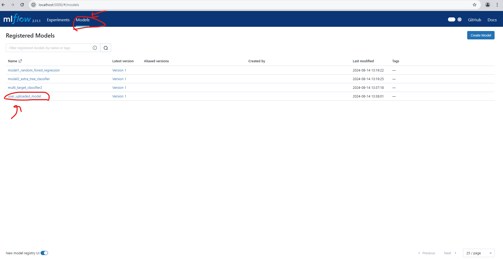

# ML ENDPOİNT SERVICE AND MODEL REGISTRY

ML model inference service solution and how to make model registry is included in this repo. To run this solution please follow steps below

# How to run
* Please use a windows 11 machine for docker service host
* In order to run the solution first of all make sure that  Docker version 24.0.6 i running on host machine
* In order to run the solution  make sure that python 3.9 or higher is installed in your env
* And clone this repo
## step 1
* Please note that i used mlflow and fast api for my docker service
* First of all You should build the docker image with this cmd in order to run mlflow tracking,registry service and api service
```
docker build -t mlflow_local .
```
## step 2
* run docker container with this cmd  in order to start services
```
docker run -d -p 5000:5000 -p 8000:8000  mlflow_local
```
* Right now your mlflow service should be accessible from
[Mlflow tracking and registry ](http://localhost:5000)


* And My Api services should be accessible from
[Api services](http://localhost:8000)

* Please note that you can check openapi swagger docs from here
[Api services swagger ui](http://localhost:8000/docs)

## step 3
* Please install necessary lib create a env for your own test
* make sure that requirements.txt is nstalled in your env
* use this cmd
```
pip install requirements.txt
```
## step 4
* you should run task1 script inorder to create basic 2 model as mentioned in task1
* model1 is Random forest regressor
* model2 is extra tree classifier
* use this cmd
```
python task1_create_models.py
```
* now, models from this script and experiment runs should be logged and versioned in mlflow tracking service and registry service with mlflow ui as shown in figure
* click experiments tab on mlflow ui to see runs

* click models tab on mlflow ui to see registired models


## step 5 make  return model request to api server for task2
* this is get model request as mentioned in task2 
* it returns a model path and some info about the model
* run this cmd to test it
```
python requests/exmp_request_get_model.py
```
* you should see output similiar to this
```
http://localhost:5000
response {'mesage': 'model is found ', 'model_uri': 'models:/model2_extra_tree_classifier/1', 'model_signature': "inputs: \n  ['age': double (required), 'gender': double (required), 'annual_income': double (required), 'purchase_amount': double (required), 'year': double (required), 'month': double (required), 'purchase_amount_group': double (required)]\noutputs: \n  [Tensor('float64', (-1, 10))]\nparams: \n  None\n"}

```

## step 6 make model upload request to api server for task2
* this is upload model request as mentioned in task2 
* it receive a binary model file and some metadata(which can be improved on the future) and save model to registry
* run this cmd to test it
```
python requests\exmp_request_upload_model.py 
```
* you should see output similiar to this
```
<bound method Response.json of <Response [200]>>
```
* also you can check new uploaded model from mlflow ui



## step 7 make online infernce request to api server for task3
* this is  online infernce request as mentioned in task3
* Please note that i've chosen model2 and its name is:
```
model2_extra_tree_classifier
```
* and its model path is:
```
models:/model2_extra_tree_classifier/1
```
* this service receive a version of model and single user json data for inference
* run this cmd to test it
```
python requests\exmp_request_upload_model.py 
```
* you should see output similiar to this
```
http://localhost:5000
respone {'mesage': 'online infer is successfull', 'data_info': 'None', 'inference_result': '[[0. 1. 0. 0. 0. 0. 0. 0. 0. 0.]]'}
```
## step 8 Task 4
*For Task 4 please go to task_4 folder
[link text](task_4/README.md)

## Discussion

 For task1 i created two models, model1 is for  next month  purchase amount regression, other model2 is a classifier which predict next month purchase with some intervals
 intervals for this model or known names bins are:
 [-3.57345,
 378.555,
 756.9,
 1135.245,
 1513.59,
 1891.935,
 2270.28,
 2648.625,
 3026.97,
 3405.315,
 3783.66]
 so this means: if model predicts 1 next purchase amount is a value between -3.57345: 378.555 $
 i thought these bins are very usefull for understanding the behaviour of user purhase trends

 I did not used customer id in my dataset but customer id can be inserted to data model for the understanding of special user groups' buy trends

 For task 2 model upload service receive model signature but cant use model signature because of i have lack of time to implement and improve this service.
 However, in order to increase productivity of user uploaded models these signatures are very important this service should use this metadata.This service requested to use of binary model file, username,model name,version,description,model_path for mlservice,model signature(not fully implemented to use it) and log params for various
 parameters that model has

 For task2 get model service return model url which is an accessible endpoint for mlfow server users.Also this service return model signature if it is found inside model metadata i think it is very usefull to understand what is the model inputs and outputs are

 For task 3 i chose  model2 which is a classifier based on bins that i mentioned before.I already explained why i chose this model

 For api service task i already put example python scripts to test this services but anyone can use any tool(Postman,Insomnia,curl etc.)
 
 I dont have enough time to implement unit tests.

 <!--  CONTACT  -->

## Contact

Ayhan Taşyurt -  [ayhantsyurt](mailto:ayhantsyurt@gmail.com)
 


